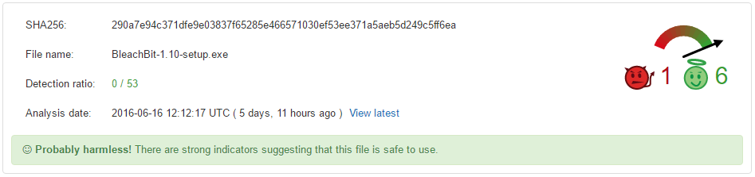
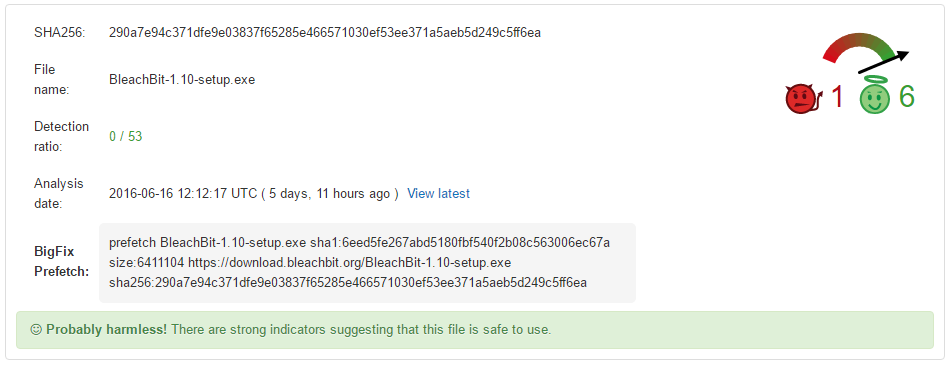

JavaScript required to create a prefetch from a virustotal analysis, meant to be used as a bookmarklet.

This site has a bunch of ads all over it, but you can find this here: http://marklets.com/VirusTotal%20to%20Prefetch.aspx

------

### Screenshots of results of VirusTotal2PrefetchTable.js

#### Before:

#### After:

------

Would be interesting to turn this into a Chrome Extension. 
- https://developer.chrome.com/extensions/getstarted
- https://developer.chrome.com/extensions/overview
- https://developer.chrome.com/extensions/content_scripts

------

Raw data to find version info within: `$('#file-details > div > div > div.floated-field-value')`
- I'd like to look at all version number info on the page and parse them all out, then get the one with the highest number of occurrences.

This should grab comment text: `$('div.comment-text > table > tbody > tr > td:nth-child(2)').text().trim()`

This should grab the first comment containing 'http': `$('div.comment-text > table > tbody > tr > td:contains("http")').first().text().trim()`

### Add prefetch to table

This should get the table at the top: `$('#basic-info > div.row > div.span8.columns > table > tbody:last-child')`

This should be the format of the tr: `<tr><td>BigFix Prefetch:</td><td>PREFETCH GOES HERE</td></tr>`

This will put the prefetch first: `$('#basic-info > div.row > div.span8.columns > table > tbody > tr:first').before('<tr><td><strong>BigFix Prefetch:</strong></td><td id="bigfix-prefetch">PREFETCH GOES HERE</td></tr>')`

This will put the prefetch last: `$('#basic-info > div.row > div.span8.columns > table > tbody > tr:last').after('<tr><td><strong>BigFix Prefetch:</strong></td><td id="bigfix-prefetch">PREFETCH GOES HERE</td></tr>')`

- http://stackoverflow.com/questions/171027/add-table-row-in-jquery

------

### Example VirusTotal analyses:
- https://www.virustotal.com/en/file/ab341c65e85ab066ab84126fa6572bcb7efe85539ba76a18e7dad77a0fd9ddb7/analysis

### Link to newest version:
- https://github.com/jgstew/tools/blob/master/JS/VirusTotal2Prefetch/VirusTotal2Prefetch.js

### Resources:
- http://stackoverflow.com/questions/360491/how-do-i-strip-white-space-when-grabbing-text-with-jquery
- https://api.jquery.com/has-selector/
- https://api.jquery.com/contains-selector/
- http://stackoverflow.com/questions/6925088/get-the-text-after-span-element-using-jquery
- http://api.jquery.com/category/selectors/
- http://stackoverflow.com/questions/9364450/jquery-how-to-get-the-text-from-a-page
- http://stackoverflow.com/questions/7269150/get-text-from-character-and-after-using-jquery
- http://chriszarate.github.io/bookmarkleter/
- http://stackoverflow.com/questions/16589511/how-do-i-get-the-raw-version-of-a-gist-from-github
- http://stackoverflow.com/questions/299802/how-do-you-check-if-a-selector-matches-something-in-jquery
- https://api.jquery.com/first/
- http://css-plus.com/2011/07/jquery-if-else-statements/
- http://stackoverflow.com/questions/8146648/jquery-find-text-and-replace
- http://stackoverflow.com/questions/14494747/add-images-to-readme-md-on-github
- http://stackoverflow.com/questions/13463557/best-way-to-make-table-cell-wider
